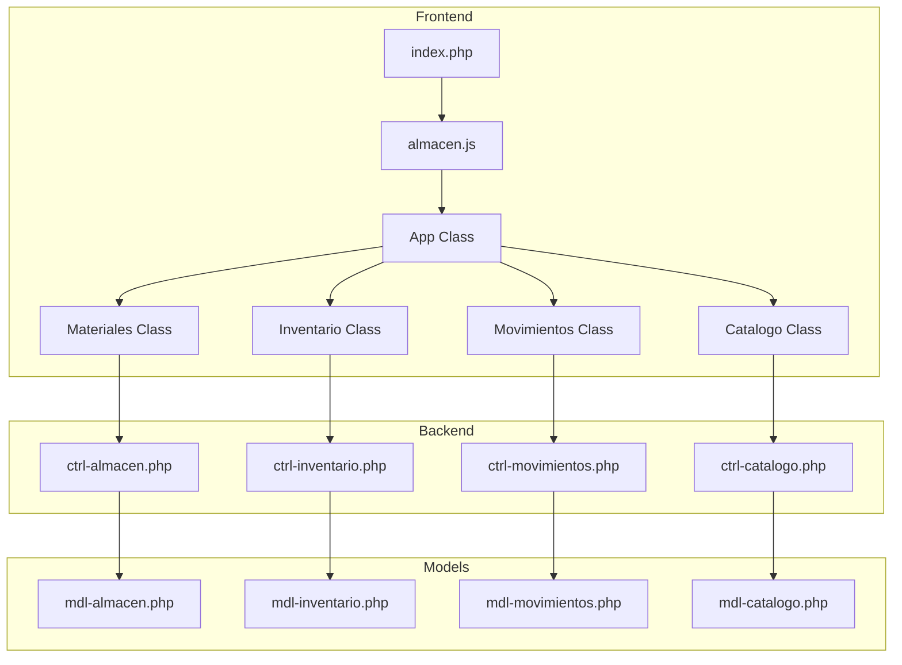

# Design Document - Sistema de Almacén ERP

## Overview

El Sistema de Almacén ERP es un módulo unificado que integra cuatro funcionalidades principales (Materiales, Inventario, Movimientos y Catálogo) en una interfaz con pestañas. Utiliza el framework CoffeeSoft con jQuery y TailwindCSS, siguiendo el patrón de arquitectura MVC establecido en el proyecto.

## Architecture



## Components and Interfaces

### Frontend Components

#### App Class (Main Controller)
- **Responsabilidad**: Orquestar la navegación entre tabs y renderizar el layout principal
- **Métodos principales**:
  - `render()`: Inicializa el layout y las instancias de módulos
  - `layout()`: Crea el primaryLayout con tabLayout
  - `initModules()`: Inicializa las clases de cada módulo

#### Materiales Class
- **Responsabilidad**: Gestión de materiales del almacén
- **Métodos principales**:
  - `filterBarMateriales()`: Renderiza filtros
  - `lsMateriales()`: Lista materiales en tabla
  - `addMaterial()`: Modal para agregar
  - `editMaterial(id)`: Modal para editar
  - `deleteMaterial(id)`: Confirmación y eliminación

#### Inventario Class
- **Responsabilidad**: Control de movimientos de inventario
- **Métodos principales**:
  - `filterBarInventario()`: Renderiza filtros con calendario
  - `lsMovimientos()`: Lista movimientos
  - `addMovimiento()`: Crear nueva lista de movimiento
  - `cancelMovimiento(id)`: Cancelar movimiento

#### Movimientos Class
- **Responsabilidad**: Historial y resumen de movimientos
- **Métodos principales**:
  - `filterBarMovimientos()`: Filtros por mes/año
  - `summaryCards()`: Tarjetas de resumen
  - `lsMovimientos()`: Lista con métricas

#### Catalogo Class
- **Responsabilidad**: Configuración de catálogos
- **Métodos principales**:
  - `layoutCatalogo()`: Sub-tabs para categorías, áreas, zonas
  - `lsCategory()`, `lsArea()`, `lsZone()`: Listados
  - CRUD para cada entidad

### Backend Controllers

Cada controlador existente se mantiene sin cambios:
- `ctrl-almacen.php`: Operaciones de materiales
- `ctrl-inventario.php`: Operaciones de inventario
- `ctrl-movimientos.php`: Consultas de movimientos
- `ctrl-catalogo.php`: Gestión de catálogos

## Data Models

### Estructura de Tabs
```javascript
tabs: [
    { id: "materiales", tab: "Materiales", icon: "icon-box", active: true },
    { id: "inventario", tab: "Inventario", icon: "icon-clipboard" },
    { id: "movimientos", tab: "Movimientos", icon: "icon-exchange" },
    { id: "catalogo", tab: "Catálogo", icon: "icon-tags" }
]
```

### APIs Existentes
Los endpoints existentes se reutilizan:
- `/ctrl/ctrl-almacen.php` - opc: init, lsMateriales, addMaterial, editMaterial, deleteMaterial, getMaterial
- `/ctrl/ctrl-inventario.php` - opc: init, lsMovimientos, addMovimiento, cancelMovimiento
- `/ctrl/ctrl-movimientos.php` - opc: init, lsMovimientos
- `/ctrl/ctrl-catalogo.php` - opc: init, lsCategory, lsArea, lsZone, CRUD operations


## Correctness Properties

*A property is a characteristic or behavior that should hold true across all valid executions of a system-essentially, a formal statement about what the system should do. Properties serve as the bridge between human-readable specifications and machine-verifiable correctness guarantees.*

Based on the prework analysis, the following properties can be consolidated:

### Property 1: Tab Navigation Consistency
*For any* tab click event, the corresponding container content should be rendered and the clicked tab should become active while others become inactive.
**Validates: Requirements 1.2**

### Property 2: Filter Application Updates Table
*For any* filter combination in the Materiales tab (department, presentation, area), applying the filter should trigger a table refresh with results matching the filter criteria.
**Validates: Requirements 2.2**

### Property 3: Edit Form Pre-fill
*For any* material in the system, when the edit action is triggered, the modal form should display with all fields pre-filled with that material's current data.
**Validates: Requirements 2.4**

### Property 4: Delete Confirmation Required
*For any* delete action on a material, the system should display a confirmation dialog before executing the deletion.
**Validates: Requirements 2.5**

### Property 5: Movement Cancellation Confirmation
*For any* movement cancellation action, the system should display a confirmation dialog before reverting stock changes.
**Validates: Requirements 3.4**

### Property 6: Period Filter Updates Summary
*For any* month and year filter selection in Movimientos tab, the summary cards and movement table should update to reflect data for that period.
**Validates: Requirements 4.2**

### Property 7: Catalog CRUD Operations
*For any* catalog entity (category, area, zone), the system should support add, edit, and status change operations that persist correctly.
**Validates: Requirements 5.2, 5.3, 5.4**

## Error Handling

- **Network Errors**: Display user-friendly error messages using SweetAlert2
- **Validation Errors**: Highlight invalid form fields and show specific error messages
- **Session Expiration**: Redirect to login page when session cookie is missing
- **Empty Results**: Display appropriate "no data" messages in tables

## Testing Strategy

### Unit Testing
- Test individual class methods for correct behavior
- Verify filter bar rendering with correct options
- Test modal form generation with proper fields

### Property-Based Testing
- Use a JavaScript property-based testing library (fast-check)
- Configure minimum 100 iterations per property test
- Tag each test with the corresponding correctness property reference

**Property Test Format:**
```javascript
// **Feature: sistema-almacen, Property 1: Tab Navigation Consistency**
test('clicking any tab activates it and renders content', () => {
    // Property test implementation
});
```

### Integration Testing
- Test tab navigation flow
- Verify data persistence through CRUD operations
- Test filter combinations and table updates
